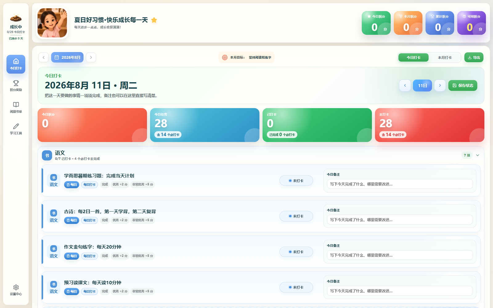
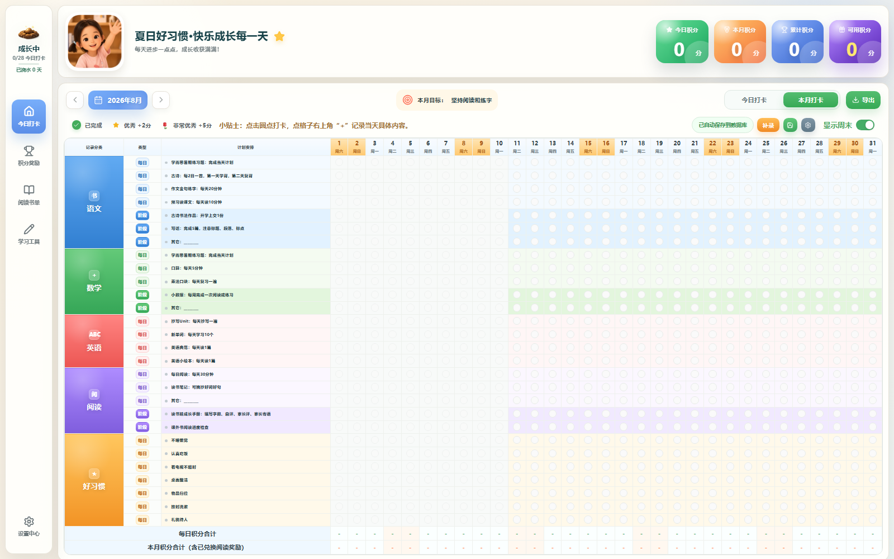
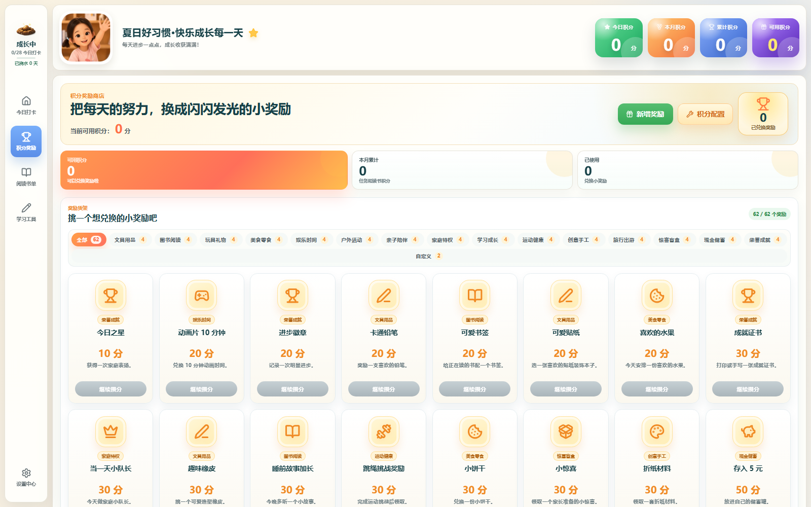
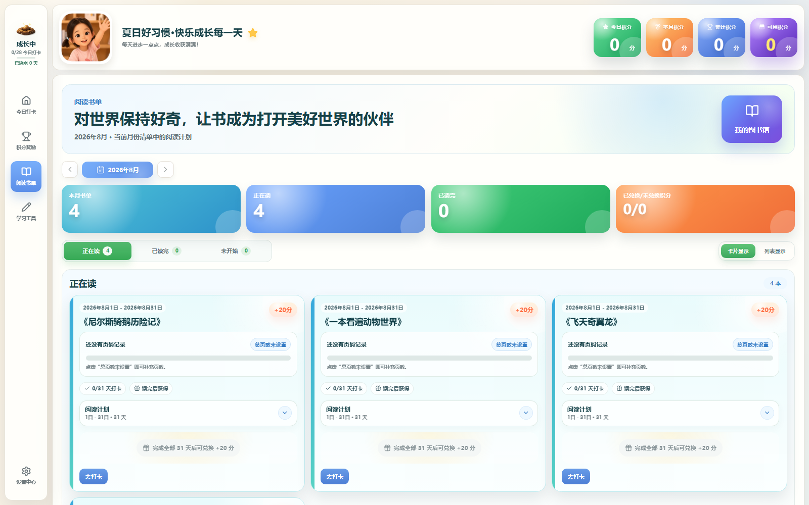
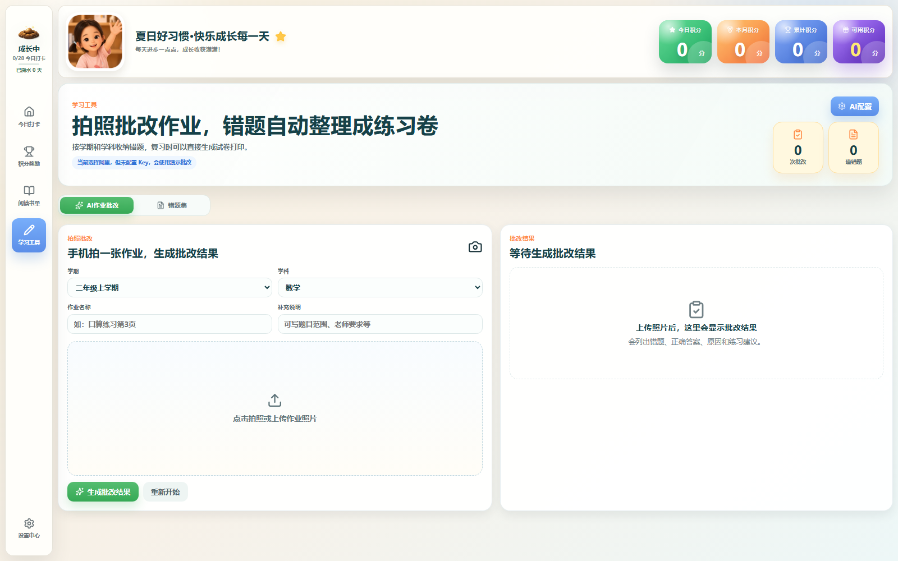

# Product Screenshots

These screenshots were generated from a fresh local database using the repository's generic template data. They contain no production database records, real child profiles, or provider credentials.

## Daily Check-in

Parents and children can see today's tasks, required items, completion state, quality, notes, and points in one place.

## Monthly Overview

The monthly matrix makes recurring, date-range, reading, and habit tasks easy to review across the whole month.

## Points and Rewards

Configurable rewards turn completed work and habits into a visible positive-feedback loop.

## Reading Plans

Reading plans track books, daily page ranges, progress, check-ins, and completion rewards.

## Optional Learning Tools

When an AI provider is configured, homework images can be reviewed and mistakes collected for later practice. Core tracking features do not require AI.

---

## 中文说明

以上截图使用全新的本地数据库和仓库内通用模板生成，不包含线上数据库记录、真实儿童资料或第三方服务密钥。页面依次展示今日打卡、本月总览、积分奖励、阅读计划和可选的 AI 学习工具。
